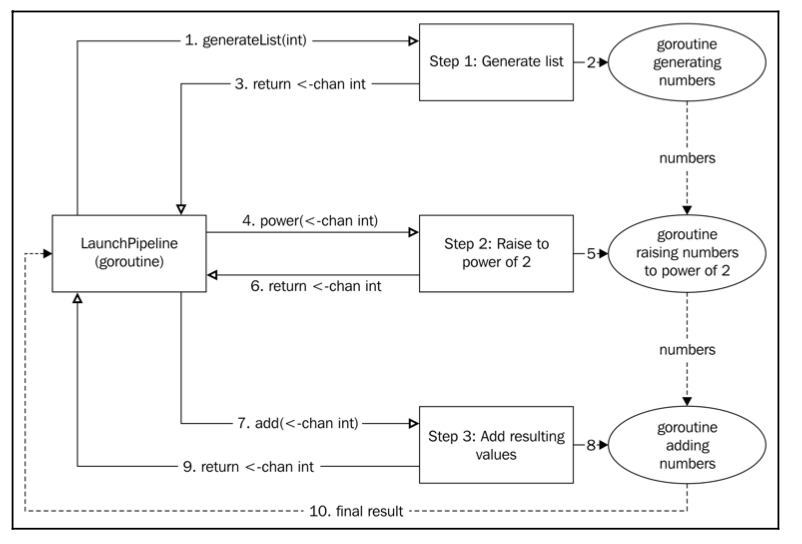

The Future design pattern (also called Promise) is a quick and easy way to achieve concurrent structures for asynchronous programming. We will take advantage of first class functions in Go to develop Futures.
